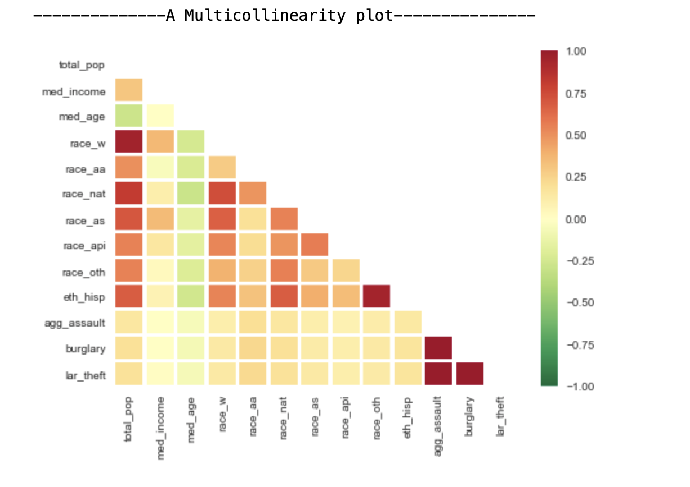
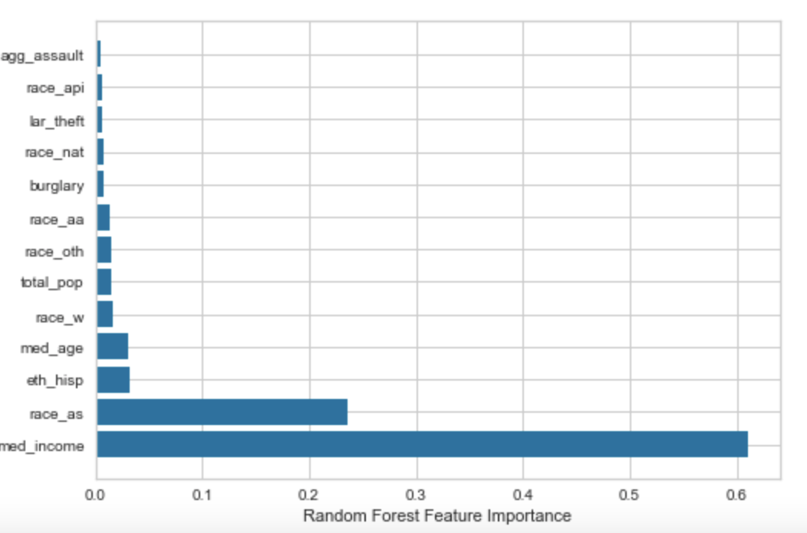
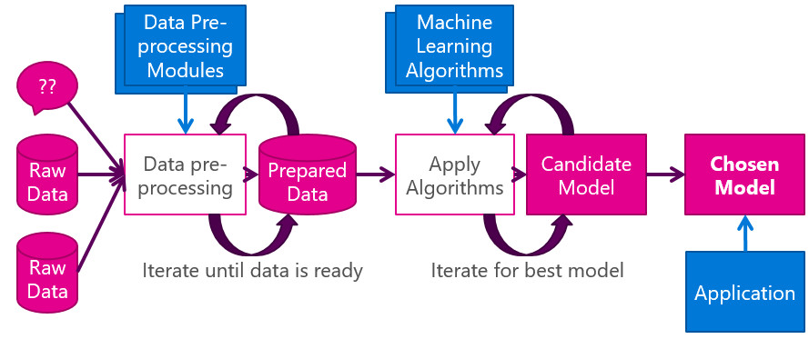
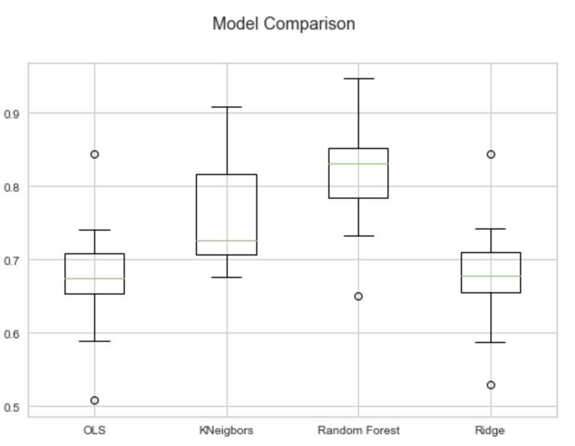
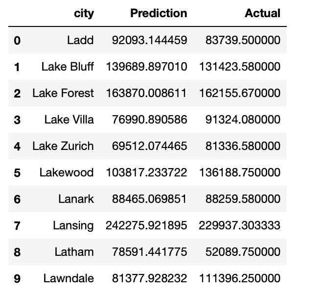
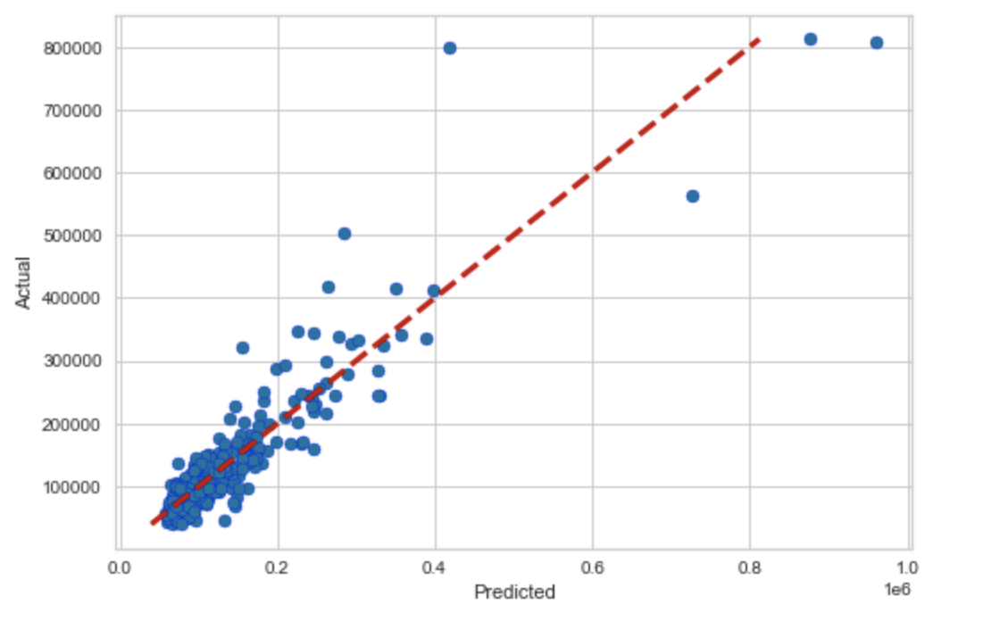
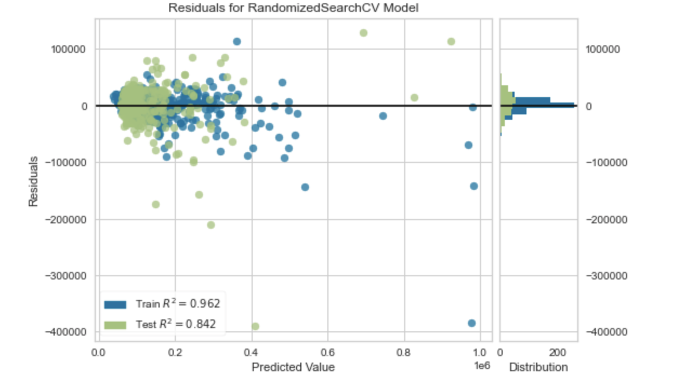
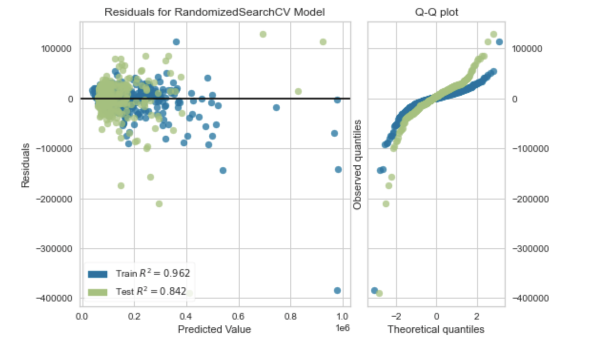
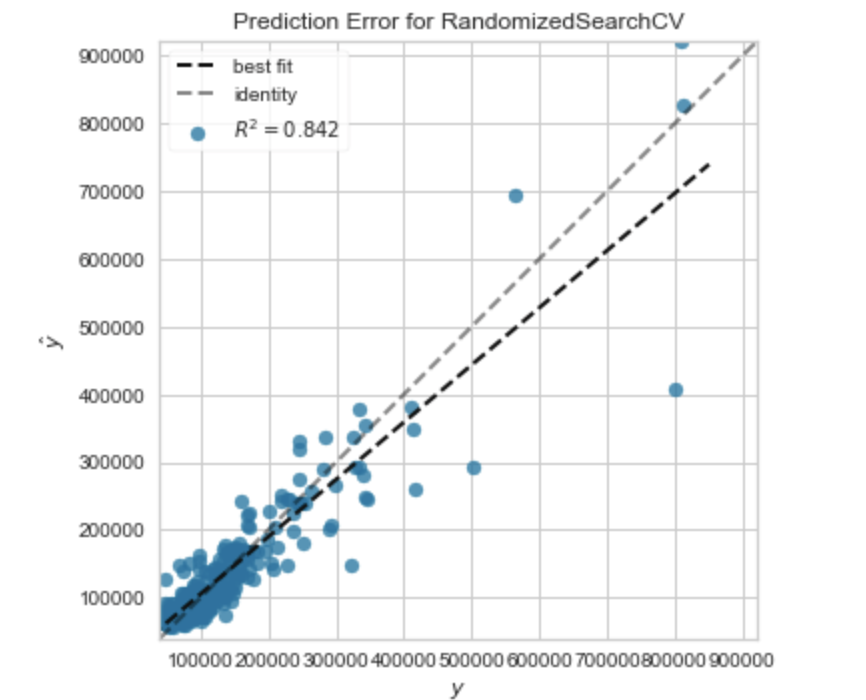

  

## Using supervised learning to determine the primary socio-economic factors that effect home prices in Illinois
---

### The Basis of our Analysis
***

#### Our Problem
Our real estate agency, The S.O.D.O. Agency, is currently looking to purchase investment properties in multiple Illinois cities. Grateful for a stable housing market during the pandemic, we want to continue to maximize our profits and purchase homes where home values are the highest and areas that will more likely give us the best R.O.I. To help us make an informed decision, we will investigate the demographics and crime data throughout Illinois, to determine the neighborhood's effect on house prices in each city in the state of Illinois. 

#### Description of the Data Sources
- Zillow (zillow.com)

  Our housing market dataset, which is broken down by city/zip code was found on zillow.com. Zillow is an online real estate marketplace founded in 2006 and created by two       former microsoft executives Rich Barton and Lloyd Frink.
  
- US Census (census.gov)

  The United States Census Bureau is a agency of the U.S. Federal Statistical System. They are primarily responsible for producing data about Americans and the American           economy. We chose data from the Census Bureau because it will allow us to look at economic factors such as income, as well as race and gender.
  
- Department of Justice FBI (ucr.fbi.gov)

  The Federal Bureau of Investigations also known as the FBI. The FBI is the U.S.'s principal federal law enforcement agency. Their data will allow us to look the crime rate in cities across Illinois. 
  
- OpenDataSoft (https://public.opendatasoft.com/)

  Similar to kaggle.com, OpenDataSoft is a platform with a selection of wide ranging datasets. Their platform offered us datasets that showed the longitude and latitude by cities in the United States (to better help with our visualizations) as well as a dataset that broken down the cities associated with zipcode (to better merge for our final table).

### Tools Used for Analysis 
***

#### Machine Learning
To begin, our data will be cleaned using PySpark, data will be stored in AWS database, and a PostgresSQL server will be used to house tables for the data. To build our machine learning model we will use a supervised machine learning and utilize the scikit-learn library for the Python programming language. Scikit-learn features various algorithms that will help us predict housing prices. See requirements.txt for packages and versions.

#### Visualization 
We have selected Tableau to transform our data into visualizations that support our findings. Tableau is user friendly as well as viewer friendly. It will allow us to create visual breakdowns that explain the data found over the course of our analysis. We were able to utilize different map layers to create serveral interactive maps with various data in Tableau. With more time we would like to learn how to export geojson data from our pgadmin database to create a layered map utilizing Javascript.

After running the our ML Model we were able to observe that Median Income, Asian (race), and Median Age are important features in determining home value across cities in Illinois. The top two being Median income and Asian (race). Image 1A, below shows the Top Ten Cities in Illinois according to the Zillow Home Value Index. The shades of orange represent median household income. Kenilworth has the highest median income and ZHVI in Illinois. The other 9 cities also represent some of the top median incomes. Image 1B, shows the population of Asian Americans by City by ZHVI. What we can gather from this visualization is the Asian American population in Illinois has a smaller presence in cities where the ZHVI is low. The population is higher in the darker shaded bubbles. 

[Tableau Visualizations](https://public.tableau.com/profile/sonja.williams3870)

  

#### Dashboard
The final presentation dashboard will be created via user.github.io. The tableau visualizations will be embedded in iFrame to maintain their interactivity.

[Dashboard](https://danjberes.github.io/FinalDashboard/)

[Presentation](https://docs.google.com/presentation/d/1ujOi3hsRpnSjERmNbjmzxzWqMrg-trTRJz7vf173qLk/edit?usp=sharing)
=======
 

### Data Exploration
***
While our concept of determining how housing prices may be impacted by various demographic and crime data initially seemed simple, as we began to consider visualizations we had to change our strategy on how best to approach the data.

We had initially hoped to view the data by zipcode, but ultimately determined organizing the data by city was necessary. In addition to offering better visualizations, the crime data we hoped to include was only organized by city. Another challenge was determining the best way to visualize the data. Once we determined we wanted to include maps, the need to include longitudinal and latitudinal data for each city became evident.

As a result of these shifts, our initial plan to merge income data ([MedianIncome_Zip.csv](https://github.com/sonjaynicolay/Final_Project/blob/liviblocker/raw_data/MedianIncome_Zip.csv)), demographic census data ([acs_data.csv](https://github.com/sonjaynicolay/Final_Project/blob/liviblocker/raw_data/acs_data.csv)), crime data ([crime_data.csv](https://github.com/sonjaynicolay/Final_Project/blob/liviblocker/raw_data/crime_data.csv)), and housing data ([zhvi_2018.csv](https://github.com/sonjaynicolay/Final_Project/blob/liviblocker/raw_data/zhvi_2018.csv)) suddenly included the need to add datasets that showed zipcode by city ([zipcode_to_city.csv](https://github.com/sonjaynicolay/Final_Project/blob/liviblocker/raw_data/zipcode_to_city.csv)) and the longitude and latitude of each city ([city_long_lat.csv](https://github.com/sonjaynicolay/Final_Project/blob/liviblocker/raw_data/city_long_lat.csv)).

As we began analysis, we also determined that it was necessary to drop various columns that were not serving our analysis. The crime data includes vio_crime and prop_crime which are actually aggregates of other crimes listed in the dataset (e.g. murder and aggrevated assault for violent crimes, and arson and robbery for property crimes). We ultimately decided to drop the aggregated vio_crime and prop_crime data points.

As we continued to refine our finalized dataset, we also made the decision to turn all null values in the crime dataset to zero. While there is a difference between cities that had, for example, no incidents of arson in 2018 vs. cities that simply did not report incidents of arson in 2018, we determined that the difference was likely negligible and that if the frequency of a particular offense were significant in a particular city it would have been reported.

#### Navigating the Joins
Due to the complexity of the joins and merges of our 6 distinct datasets - this section is to help navigate the process. In the [data_merging](https://github.com/sonjaynicolay/Final_Project/tree/liviblocker/data_merging) folder, you can find 4 folder and an ERD image. To follow the process of merging I recommend viewing the files in the following order:
1. [schemas.sql](https://github.com/sonjaynicolay/Final_Project/blob/liviblocker/data_merging/schemas.sql) shows the development of schemas in PGAdmin into which the raw data will be input.
2. [AWS_to_PGAdmin](https://github.com/sonjaynicolay/Final_Project/blob/liviblocker/data_merging/AWS_to_PGAdmin.ipynb) shows the process of bringing the raw data files from AWS, initial cleaning, and the upload into PGAdmin.
3. [queries.sql](https://github.com/sonjaynicolay/Final_Project/blob/liviblocker/data_merging/queries.sql) shows the initial merges of the demographic and housing data.
4. Finally, [Development_of_FinalTable.ipynb](https://github.com/sonjaynicolay/Final_Project/blob/liviblocker/data_merging/Development_of_FinalTable.ipynb) pulls data from PGAdmin back into a Colab file, aggregates the zipcodes by city, and merges the newly aggregated table with the crime data and coordinate data.

Below you can see the ERD that breaks down the merges:

  

### Data Analysis
#### Feature Engineering.
After checking for multicollinearity and features importance, we decided to drop features positively correlated and those that fall below the 0.025 features importance threshold.

#### Data Preprocessing
To avoid over fitting problem and evaluate the performance of our algorithm, we decided to standardized and split our dataset into training and testing data 
#### Model Selection 

We decided to choose Random Forest Regressor because of the following reasons:
-	It gives the highest R-square value compare to other algorithms. 
-	It gives minimum Mean Absolute Error(MAE) and Root Mean Square Error (RMSE) compare to other algorithms we evaluated.
-	It reduces overfitting in decision trees and helps to improve the accuracy
-	Random Forest can automatically handle missing values.
-	Random Forest is usually robust to outliers and can handle them automatically.
#### Limitation of model selected 
- Random Forest require much more time to train as compared to decision trees as it generates a lot of trees (instead of one tree in case of decision tree) and makes decision on the majority of votes.
-It requires much computational power as well as resources as it builds numerous trees to combine their outputs. 
- Due to the ensemble of decision trees, it also suffers interpretability and fails to determine the significance of each variable.
#### Model Optimization
We made use of RandomSearchCV to get the best params for our model: max_features 9, min_samples 4, n_estimators 406, r2 0.84

#### Prediction
The figure below are the outputs of our prediction and actual values of the houses in illinois cities.

#### Evaluation 
- The best params produced r-square of 0.84. This implies that 84% accuracy of house prices prediction.
- 
- 
- 
- The error seems not to be far from the best fit line with an exception of few outliers.
- 
